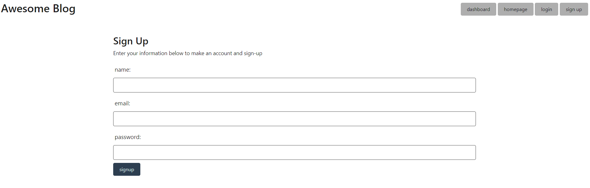
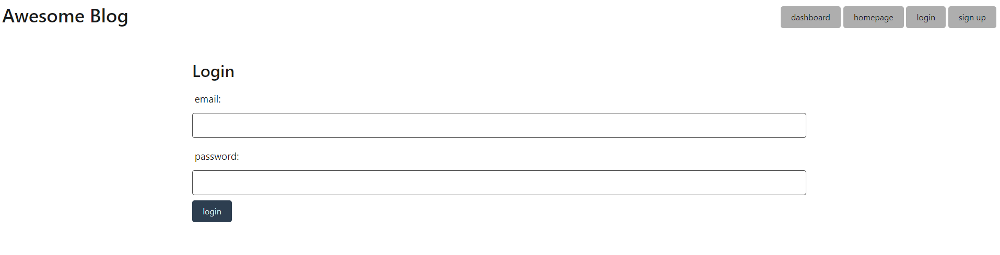
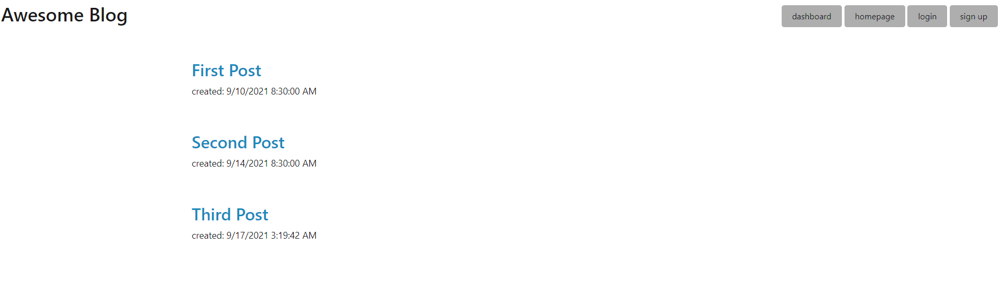

# <ins>Blog Site</ins>


## Description

This is a full stack, ready-to-deploy, blog website. It is complete with a mysql database and a simple front end UI. The user can create an account, view posts, add posts, edit posts, and comment on posts. It is a great starting point to build off of if you want to build your own version of a blog website. 

## <ins>Table of Contents</ins>
- [Installation](#installation)
- [Usage](#usage)
- [Questions](#questions)

## <ins>Installation</ins>

Before this site can be used, be sure to fill out the .env.EXAMPLE file with your database information. Next, you will also need to make a clean database called "blog_db"

with the database created, run the following code in the command line from the ame directory as "server" in order to seed the database
 ```md
node seeds/index.js
 ```

Be sure to run the following command in a terminal that's opened in the same directory as server.js:
 ```md
 npm install
 ```
Finally, you can run the following code to run the backend and see it in action in an app like insomnia

 ```md
node server.js
 ```


## <ins>Usage</ins>

Below are screen shots showing some of the blog UI. 

SIGN UP:


LOG IN:


HOMEPAGE:


DASHBOARD:


Here is a [DEMO OF THE SITE](https://arcane-dawn-89948.herokuapp.com/) that is hosted by heroku. 


## <ins>Questions</ins>
Contact the creator of this E-Commerce Backend at lukeajcole@gmail.com. Github link: https://github.com/lukeajcole


